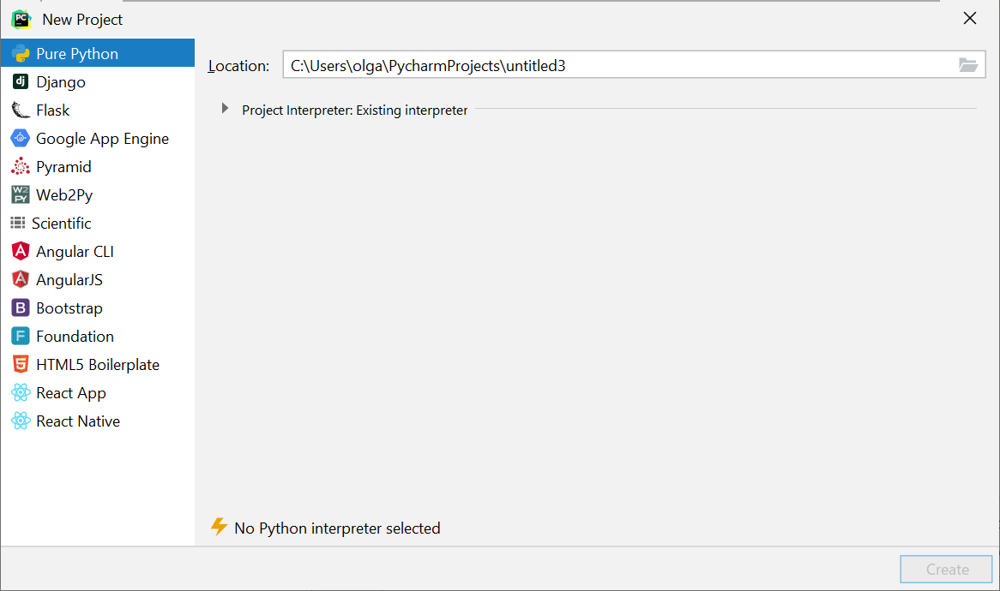

## Запуск Python из консоли

Запустить питоновский скрипт из консоли: 

`python hello_world.py` -- для Windows,

`python3 hello_world.py` -- для Linux и macOS

Вместо `hello_world.py` можно подставить имя любого скрипта.

## PyCharm: настройка интерпретатора

При создании проекта в PyCharm нужно указать правильный интерпретатор. Для этого нажимаем *Project Interpreter: Existing interpreter*



(рис. 1)

Дальше выбираем *Existing interpreter* и нажимаем на три точки слева.


(рис. 2)

Появляется такое окошко. Выбираем *System Interpreter* и находим интерпретатор в файловой системе. На Windows это что-то вроде *C:\Users\olga\AppData\Local\Programs\Python\Python38-32\python.exe*, в macOS -- что-то вроде */usr/bin/python3.7* или */usr/local/bin/python3.7*.


 (рис. 3)

Также можно настроить интерпретатор в уже существующем проекте. Для этого выбираем *File > Settings* в Windows/Linux или *Pycharm > Preferences* в macOS. Дальше выбираем *Project > Project Interpreter*, нажимаем на значок настроек справа и попадаем в окошко для выбора интерпретатора (см. рис. 3).


## Статические анализаторы

Статические анализаторы или линтеры анализируют файлы с исходным кодом, не запуская при этом сам код. Очень часто используется для базовой проверки стиля кода.

### Лирическое отступление про качество и стиль кода

Частично взято из [этой статьи](https://realpython.com/python-code-quality/#what-is-code-quality) + мои мысли на тему.

#### Что такое хороший код?

Все мы хотим писать качественный код. Наш курс как раз про то, как писать качественный код. Но для того, чтобы начать улучшать качество нашего кода, для начала стоит определить, что это такое. 

Чаще всего под качественным кодом подразумевают следующее:

- **Код делает то, что ему положено делать.** В конце концов, в реальной жизни мы пишем код для того, чтобы он делал что-то полезное. Если он не делает то, что от него ожидается, то его качество точно нельзя назвать высоким.

- **В коде нет дефектов и багов.**  Если вы используете какой-нибудь софт, и он постоянно ломается / глючит / тормозит, то вы вряд ли будете считать его качественным.

- **Код легко читать, поддерживать и расширять. ** Допустим, вы работаете в команде из нескольких разработчиков над каким-нибудь кодом. И пользователь запросил новую фичу. Человек, который писал исходный код, давно ушёл работать в другое место. Человек, который его заменяет, должен разобраться в существующем коде и добавить к нему новую функциональность. Представьте, что этот человек -- это вы. Если код слишком сложный и плохо читается, вам потребуется больше времени, чтобы в нём разобраться. Также было бы здорово, чтобы было легко добавить новую фичу, не поломав при этом старые. Если код плохо расширяется, то сделать это будет сложно. Вы сами сможете в этом убедиться, сделав сначала первую, а потом вторую часть первого дз.

#### Code review

  Для того, чтобы проверять качество кода, существует процесс code review. После того, как вы написали код, вы отправляете его на проверку другому человеку. Он смотрит на него и пишет какие-то замечания. Вы как-то отвечаете на  эти замечания (**не обязательно сразу исправляете всё так, как вам скажут**, возможно, у вас была какая-то мысль, которую проверяющий не понял), после этого он смотрит ещё раз и так до тех пор, пока ваш код ваш код не станет близок к идеальному и вы придёте к соглашению. Тогда ревьюер отправляет вам LGTM (looks good to me) и только после этого ваш код продакшн, то есть начинает где-то использоваться. Так происходит практически во всех компаниях. (Про то, как этот процесс code review может быть организован технически, чтобы всем участникам было удобно, поговорим на следующей паре.)

#### Code style

  Несмотря на то, что все люди более-менее согласны, что код должен быть качественным, могут быть принципиально разные мнения насчёт того, как этого достичь. 

### flake8 и pylint

В домашках нужно будет каждый раз перед отправкой кода на проверку запускать 

```bash
flake8 --max-line-length=100 <имя файла>
```

и 

```bash
pylint --max-line-length=100 --disable=invalid-name,missing-docstring,global-statement,too-many-lines,R --enable=simplifiable-if-statement,redefined-variable-type <имя файла>
```

Например, когда у нас есть файл `hello_world.py`, запуск этих команд выглядит так.

```shell
flake8 --max-line-length=100 hello_world.py
pylint --max-line-length=100 --disable=invalid-name,missing-docstring,global-statement,too-many-lines,R --enable=simplifiable-if-statement,redefined-variable-type hello_world.py
```

Можно также запустить анализ для всех файлов в текущей директории.

```shell
flake8 --max-line-length=100 .
pylint --max-line-length=100 --disable=invalid-name,missing-docstring,global-statement,too-many-lines,R --enable=simplifiable-if-statement,redefined-variable-type *.py
```

В целом, `pylint` и `flake8` часто находят одни и те же ошибки. Про то, чем они отличаются можно почитать [тут](https://www.reddit.com/r/Python/comments/82hgzm/any_advantages_of_flake8_over_pylint/) или [тут](https://www.slant.co/versus/12630/12632/~pylint_vs_flake8).

### mypy

Python -- язык с динамической типизацией. Это значит, что нам не требуется указывать тип, а он определяется самостоятельно. Но это часто бывает неудобно. Например, иногда бывает сложно определить, какие аргументы нужно передать в функцию.


## Функция to_lowercase(l)

### Решение в лоб

```python
def to_lowercase(l):
    res = []
    for s in l:
        res.append(s)
    return res
```


### List comprehension

```python
def to_lowercase(l):
    return [s.lower() for s in l]
```

### Map

```python
def to_lowercase(l):
    return list(map(lambda s: s.lower(), l))
```

